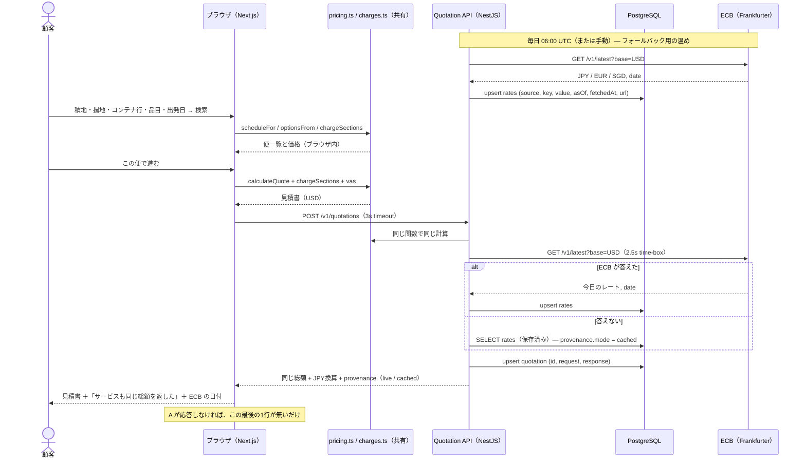

# 最終発表 台本（30分）— 9/18

構成は `1.md` の4部立て。時間配分は右。**太字はそのまま口に出す一文**、
▶ は操作、→ は画面で指さす数字。

| 部 | 内容 | 時間 |
| :-- | :-- | --: |
| 0 | 自己紹介（別スライド）と今日の流れ | 0:00–2:00 |
| 1 | デモ（サイトを動かす） | 2:00–16:00 |
| 2 | アーキテクチャ | 16:00–23:00 |
| 3 | つまずきと学び | 23:00–26:00 |
| 4 | フィードバックをもらう | 26:00–30:00 |

---

## 発表前チェック（当日朝、10分）

```bash
# 1. DB と API
/opt/homebrew/opt/postgresql@16/bin/pg_ctl -D /opt/homebrew/var/postgresql@16 start
cd api && SWCRC=true node --import @swc-node/register/esm-register src/main.ts &
curl -s -X POST localhost:4000/v1/ingest/run        # ECB レートを当日分に
curl -s localhost:4000/v1/health                    # {"ok":true,"rates":4,"ports":2272}

# 2. サイトは本番ビルドで（dev の初回コンパイル待ちを消す）
cd .. && pnpm build && pnpm start                   # http://localhost:3000
```

- ブラウザは **1440px 以上、ズーム 100%**、右上の言語は **日本語**
- タブを3つ開いておく：`localhost:3000`、`localhost:4000/docs`（Swagger）、
  `localhost:3000/engineering?n=booking`（技術詳細を開いた状態）
- ローディング画面はタブごとに1回。**見せたいなら新しいタブで開く**
- プロセスの3Dは本番ビルドなら1秒で出る。dev なら初回12秒かかるので dev では見せない
- 万一 API が落ちていても**サイトは全部動く**。見積書の下に「ブラウザ内で計算しました」と出るだけ。その場合は「これが設計どおりのフォールバックです」と言えばよい

---

## 0. 導入（2分）

自己紹介スライドの後、1枚だけ。

**「見積りから本船の接岸まで、海上輸送の1件の取引を、事業・システム・作り方の3方向から分解したサイトです。今日はサイトを触りながら話します。」**

課題の逸脱を先に言う（後で突っ込まれるより先手）：

**「課題では Streamlit でしたが、2週目の技術オンボーディングで教わった本番と同じ Next / Nest / PostgreSQL で作りました。実物の ONE QUOTE を触った後に、入力欄も実物に合わせて作り直しています。」**

---

## 1. デモ（14分）

### 1-1. ホーム（1分）

▶ 新しいタブで `localhost:3000` を開く（ローディング：船が3点を跳ぶ、Loading. .. ...）

**「サイトの数字は全部コードが計算しています。手で書いた数字は1つもありません。」**

▶ 少しスクロール → 見積→予約→配送の帯、3つの入口。

**「入口は3つ。今日はこの順で回ります。」**

### 1-2. ビジネス — 実物の ONE QUOTE の3ページ（5分）

▶ ビジネスへ。

**「実物の ONE QUOTE と同じ3ページ構成です。私が実際に触って、そのまま再現しました。」**

**1ページ目**
- → 積地の国セレクトを「韓国」に → 港が釜山になり、下の注記が「この航路：およそ 10,500 海里、31 日」に変わる
  **「港は UN/LOCODE の実データです。7か国 2,272 港のうち座標のある 610 港。運賃と日数はこの座標から距離を出して導いています — 高雄とジェベルアリは一覧に座標が無いので出せない、とそのまま書いてあります」**（元の日本に戻す）
- ▶ コンテナ行で「別の種別を追加」→ REEFER40H を1本足す。品目を「冷凍食品」に。
  → 重量欄の「1本あたり」、種別が **DRY20/DRY40H/REEFER20/REEFER40H の4つだけ**なこと
- ▶ 品目を「一般貨物」のまま冷凍にすると赤いエラー → **「冷蔵・冷凍はリーファー必須、というルールが弾きます」**（元に戻す）
- ▶ カレンダー → **「船の出る日だけ押せて、日付ごとにその構成での最安値が出ます。実物と同じです」**
- ▶ 「選択肢を検索」

**2ページ目**
- → 上段の「運賃の表示範囲」のチェック。「積地費用」を外す → 全カードの価格が同じ額だけ下がる
  **「4つのグループを出し入れすると、全部の便の価格が連動します。何がいくらか、見積書を開かずに分かる」**
- ▶ 「タリフ通貨」に切替 → 予算が ¥ / $ / S$ の3行に
  **「タリフはそれぞれの通貨で公示されているので、その通貨で。換算は ECB の当日レートで、右に日付が出ています」**
- ▶ おすすめ便の「詳細」→ タイムライン（書類→CY→VGM→出港→到着）と費目
- ▶ 「この便で進む」

**3ページ目**
- ▶ 付加サービス：揚地のフリータイムを「+」で2日 → 合計が動く
  **「実物にあるとおり、フリータイムは14日込みで、追加は日単位で買えます」**
- → 見積書の一番下：**「総額（JPY 換算）」と「見積りサービスも同じ総額を返し、QTN-… として発行」**
  **「ここだけがブラウザの外から来ています。API が同じ計算をして、いま ECB から取ったレートで円換算し、見積りを保存しました。『この見積りのために取得』と書いてあるのはそのためです」**

### 1-3. API を見せる（2分）

▶ Swagger タブ（`localhost:4000/docs`）

**「バックエンドは NestJS。この画面は仕様書で、コードから自動生成されています。」**

- ▶ `GET /v1/rates` → Try it out → Execute → ECB の4レート（JPY・EUR・SGD・KRW）と **asOf / fetchedAt / url**
  **「見積りのたびに ECB へ取りに行きます。数字に出どころと取得時刻が付き、取れなかった場合は保存済みの値を『cached』と明記して使う。黙って古い値を出すことはない」**
- ▶ `GET /v1/quotations/{reference}` にさっきの番号 → 発行した見積りがそのまま再生される
- 言う：**「計算のコードはフロントと同じファイルを import しています。だからブラウザと API が違う数字を出すことはない」**

### 1-4. エンジニアリング（3分）

▶ `localhost:3000/engineering`。**画面下の「scroll」が浮いている**のを一瞬見せてスクロール開始。

**「見積りボタンを押してからの1.3秒。5つの工程を1画面ずつ。」**

- ▶ 1〜6コマを流す。止まるたび、左のイラストと右の「事業として起きること」を一言ずつ
  - 2：**「壊れた依頼は入口で止まる」**
  - 3：**「販促で8倍になっても基幹は感じない」**
  - 5：**「72時間の有効期限はここから数え始める」**
- → 下端の時計が **0 → 1274 ms** に進む
- ▶ 「なぜ分かれているのか」の3枚を指す（読まなくていい）
- ▶ 「図・コード・ログを開く」→ システムマップ → **ONE Quote Booking** をクリック → 経路が引き直され、右にトレースとログ
  **「これがさっきの紙芝居の元データです。同じ1回の走査からコマも時計もログも出ています」**
  **「この地図は TA に確認しました。サービスの一覧と分け方、ゲートウェイが2つ（Node.js と Apigee）、分析が BigQuery で取引 DB から完全分離 — ここまでが確認済み。矢印の向きと Booking の中身は私の読みで、図にそう書いてあります」**
- ▶ 「C4ビュー」タブ → Context / Container / Component の3枚（Mermaid）
  **「C4 は c4model.com の定義をそのまま引用しています。Level 4 は IDE が出せるので作っていない、と本家が言っているのでそうしています」**

### 1-5. プロセス（2分）

▶ `localhost:3000/process`

**「仕事の単位は2週間でした。いまは72稼働時間です。」**

- → 「同じ仕事。違う流れ。」の2枚の絵
- → **「スループットは3倍。見つかる欠陥は5倍。」** — ここは正直に：
  **「この2つは AI-DLC 導入時に参照した外部 POC ベンチマークの値で、うちのチームの実測ではありません。先週まで私は『社内の実測』と書いていて、TA に直されました。チームの記録は Jira に隔週で全部入っていますが、倍率としてはまだ出ていない。5倍は『見つかる』欠陥で、Bot QA を置く根拠です。」**
- ▶ 「シミュレーションを開始」→ AI-DLC に切替 → 「3 SP」を2回クリック → 1.7日で完了
  **「4フェーズの1サイクル。上限の72稼働時間は TA 確認済みの値で、1日8時間・最大の作業が窓を使い切る、という対応づけだけが私のモデルです」**

### 1-6. スクラムガイド（1分）

▶ ページ末尾「スクラムガイドと理解度チェック」

**「チートシートはスクラムガイド2020そのまま。下の5問はこのページとビジネス画面から出ます。」**（クイズは1問だけ答えて終わり）

---

## 2. アーキテクチャ（7分）— スライド

### 2-1. 全体（1枚）

C4 の Container 図をそのまま貼る（エンジニアリングの C4ビューをスクショ）。

```
ブラウザ（Next.js 16, 静的5ルート）
   │ POST /v1/quotations（3秒でタイムアウト → ブラウザ内計算にフォールバック）
   ▼
Quotation API（NestJS, Swagger /docs）
   │ Prisma
   │ 見積りのたびに ECB へ（2.5秒で諦めて保存済みレートを「cached」と明記）
   ▼
PostgreSQL 16 ── rates（ECB）/ ports（UN/LOCODE）/ quotations
   ▲
   └── Ingest（毎日 06:00 UTC / 手動）← UN/LOCODE CSV、ECB（フォールバック用の温め）
```

一言：**「フロントは静的。API は足し算。API が無くても同じページが、1行少ないだけで出る」**

### 2-2. 技術スタック（1枚）

| 層 | 選択 | 理由 |
| :-- | :-- | :-- |
| FE | Next.js 16 App Router, Tailwind v4（CSS-first トークン） | 本番と同じ。トークン外のクラスは**何も出力しない**ので、デザインシステム違反が構造的に起きない |
| 構成 | Atomic Design（atoms / molecules / organisms / templates / providers） | レビュアーの指定。フォルダ名で読める |
| BE | NestJS + Prisma + PostgreSQL 16, Swagger | 本番と同じ。Controller → Service → Repository, DTO で検証 |
| 実行 | Docker Compose（db + api） | `docker compose up` で誰の環境でも同じ |
| 共有 | `src/lib/pricing.ts` 等を FE と API が**同じファイルとして** import | 2つの計算式は2つの数字になる。1つにする |
| i18n | Lokalise → `src/locales/*.json` を直接 import | 翻訳基盤の障害でサイトが落ちない |
| 3D | three.js（プロセス画面の1チャンクだけ） | 他のページは1バイトも払わない。ESLint で囲っている |

### 2-3. 見積りのシーケンス図（1枚）



### 2-4. 数字の出どころ（1枚）

**「このサイトの主張は『数字は計算している』ですが、それだけでは足りなくて、どの数字がどこから来たかを1行ごとに言えるようにしました。」**

| 種類 | 例 | 出どころ |
| :-- | :-- | :-- |
| POC ベンチマーク（外部） | スループット×3、見つかる欠陥×5 | AI-DLC 導入時に参照した実証実験。チーム自身の倍率は Jira の隔週記録からまだ出ていない |
| 外部の公開データ | 為替（JPY/EUR/SGD/KRW）、港 610 件と座標 | ECB 参照レート（見積り時に取得）、UN/LOCODE |
| 文書・TA 確認 | Bolt 最大72稼働時間、サービス一覧、2つのゲートウェイ、BigQuery 分離 | AI-DLC 文書と TA の回答（9/16） |
| モデル | 距離→運賃・日数の直線、チョークポイント経路、サーチャージ、待ち行列の定数 | 私の仮定。ページにそう書いてある |
| **未計測** | Bot QA が止めた件数 | **無い。ページにそう書いてある** |

---

## 3. つまずきと学び（3分）

正直に3つ。全部、直した後の状態で話す。

1. **見積りの入力を想像で作っていた。** 課題表の「CBM と3種別」で作り、実物を触ったら「本数×重量、4種別、品目、日付」だった。**一次情報を先に取るべきだった**。3日で作り直した。
2. **非エンジニアに読めなかった。** 営業部長役と人事役の2人にレビューさせたら総合 5/10 と 4/10。「同じ便に金額が3つ」「JSON の箱でスクロールが止まる」「用語が説明なし」。2回転で 6/10 と 5.5/10。**書いた本人には見えない**ので、レビューを回す仕組みごと残した。
3. **バックエンドで黙って壊れていた。** tsx（esbuild）はデコレータのメタデータを出さないので、Nest の DI が注入できず、**バリデーションが何も検証していなかった**。エラーは出ない。テストで `bogus` フィールドを送って初めて気づいた。swc に替えた。

4. **確認せずに「実測」と書いていた。** ×3・×5 を社内の実測と書き、システムマップも推定のまま出していた。TA に5問の文章で聞いたら、2日で全部返ってきて、3箇所を直した。**聞けば答えてもらえることを、聞かずに想像していた。**

まとめの一文：**「一番の学びは、『動いている』と『正しい』は別で、正しいと言えるのは出どころを示せる範囲だけ、ということです。」**

---

## 4. フィードバックをもらう（4分）

聞きたいことを先に3つ出しておくと、質疑が空転しない。

1. **Bot QA の実測** — 自分たちのデリバリーで実際に何件止めたか、数える手段はあるか
2. **見積りの費目コード** — 実物の詳細パネルに並ぶ費目名と、「tariff」表示の正確な意味
3. **サービス間の矢印** — サービス一覧は確認済み。Booking がどの順で Schedule / Rate Engine / Space を呼ぶか、OSL+ の中身

---

## 想定質問

- **なぜ Streamlit でないのか** → 本番のスタックで作るほうが、学んだことをそのまま使える。課題の「Python」は手段で、目的は「動くハブと発表」だと解釈した
- **本物のレートは？** → 船社料率は非公開。だから「モデル」と明記し、取れるもの（為替・港）だけ本物を取った
- **API が落ちたら？** → 3秒でブラウザ内計算に戻る。見積書に「ブラウザ内で計算しました」と出る（実演可）
- **ECB が落ちたら？** → 2.5秒で保存済みレートに戻り、見積書に「いま取れなかったので {日時} に保存したレート」と出る。`ECB_URL=http://127.0.0.1:9` で API を起動すれば実演できる
- **インコタームズは？** → 船社の見積りは輸送範囲（CY / Door）で表す。インコタームズは売主・買主の契約なので外した
- **3倍・5倍は本当か？** → 外部 POC ベンチマークの値。チーム自身の実測ではない、とページに書いた。公開調査（1.5倍・1.4倍前後）は別のモーダルに、他社のものとして置いてある
- **なぜ先週と言うことが違うのか** → TA に確認して直した。「確認前は推定、確認後は事実」と分けて書くのがこのサイトの方針で、直した履歴はコミットに残っている
